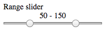
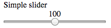

# Range Slider

A simple range slider element

## Getting Started

You just have to include the JS and the CSS as CDN

### Prerequisites

Set these CDN in the `head` tag of your HTML

```
<link rel="stylesheet" type="text/css" href="https://rawgit.com/fifiblop/doubleRangeSlider/master/rangeStyle.css">
<script src="https://rawgit.com/fifiblop/doubleRangeSlider/master/rangeSlider.js"></script>
```

The first line will include basic css code to display the range slider.
The second will include the js to display current value of the range slider.

### Range slider



Include this snippet in your HTML for a range slider

```
<label for="rangeSlider">Range slider</label>
<section id="rangeSlider" class="range-slider">
    <span class="range-values"></span>
    <input type="range">
    <input type="range">
</section>
```

### Simple slider



This one for a simple slider

```
<label for="simpleSlider">Simple slider</label>
<section id="simpleSlider" class="range-slider">
    <span class="range-values"></span>
    <input type="range">
</section>
```

## Author

* **Philippe delefosse** [fifiblop](https://github.com/fifiblop)